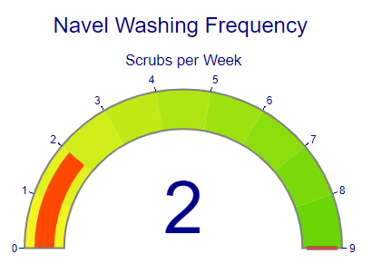
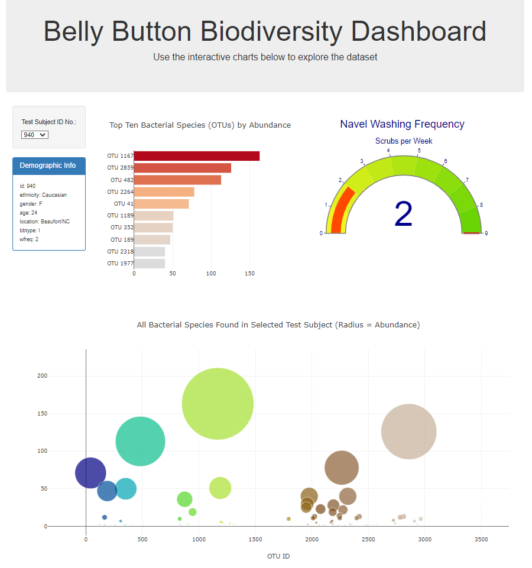

# Navel-Biodiversity-Analysis
- Taxonomic Diversity of Microbial Species in the Human Navel
- Link to deployed GitHub page: https://vinnyshankar.github.io/Navel-Biodiversity-Analysis/
### - Overview
- Author: Vinny Shankar
- Acknowledgements:
    - Study Groups: worked together with several students to understand the assignment
    - Students: [Hany Dief](https://github.com/hanydief), [Jed Miller](https://github.com/Jed-Miller), [Jésus Jímenez](https://github.com/JesusJimenez3318), [Shridhar Kamat](https://github.com/shriparna), [Ajay Gopalkrishna](https://github.com/ajoyg)
    - Program: University of California Berkeley Data Analytics Bootcamp
    - Starter Code: The Module Challenge provided starter code that guided the process
    - Instructor: Ahmad Sweed
    - Tutor: [Bethany Lindberg](https://github.com/bethanylindberg)
    - Reference: Hulcr, J. et al. (2012) A Jungle in There: Bacteria in Belly Buttons are Highly Diverse, but Predictable. Retrieved from: http://robdunnlab.com/projects/belly-button-biodiversity/results-and-data/
### - Contents
- One `static/js` directory containing:
    * An `app.js` file with the JavaScript code

- One `index.html` file containing the HTML
- One images directory containing screenshots of the deployed page
### - Description
* The original study examined the microbial diversity in the navels of 153 individuals. The researchers provided their data to the public in several formats, including JSON.
### - Visualization
* Link to deployed GitHub page: https://vinnyshankar.github.io/Navel-Biodiversity-Analysis/
* A dropdown menu is created and populated with the unique id for each of the 153 individuals in the study.         

* When the user selects a new id from the dropdown, the following actions occur:
    - A horizontal bar chart is generated showing the top 10 bacterial species (OTUs) by abundance found in that individual.            
    
    - A demographic info table is populated with that individual's id, ethnicity, gender, age, location, bbtype (belly-button type), and wfreq (wash frequency).            
    
    - A bubble chart is generated showing all the bacterial species identified in that indiviual. Each bubble represents one bacterial species, where the radius of the bubble is proportional to the observed abundance of that species in that individual.            
    
    - A washing frequency gauge is generated, showing a visual representation of how many times that individual washes their navel in a given week.         
    
* Full page view:           

